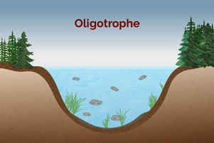
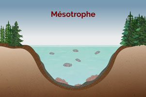

(section2-5)=
# Conclusion

En conclusion, dans ce module Eau potable et gestion durable

* Nous avons distingué les étapes conventionnelles et complémentaires de production de l’eau potable. Puis, nous avons démontré que l’eau du robinet est un meilleur choix que les eaux embouteillées tant pour sa qualité que ses impacts environnementaux. La réalité de la surconsommation d'eau potable au Québec et des fuites en réseau nous a amené à explorer des pistes de solutions.
* Nous avons vu comment les activités humaines et les changements climatiques engendrent des conséquences sur la qualité et la quantité des sources d’eau potable. Une illustration est l’eutrophisation des plans d’eau avec des impacts pour les milieux aquatiques, les activités socio-économiques et l’approvisionnement en eau.
* Enfin, nous avons eu un aperçu des stratégies de protection, des mesures de suivi et de la réglementation à ajuster de façon proactive pour une gestion durable des sources d'eau potable.

```{figure} images/M2.5_Production.jpg
:alt: Image Production de l'eau potable
:width: 900px
:align: center
Production de l'eau potable
```

:::{figure}
:label: eutrophisation2
:align: center

(figure-eutrophisation2)=




Eutrophisation d'un plan d'eau
:::

```{figure} images/M2.5_Reglementation.jpg
:alt: Image Réglementation et gestion
:width: 900px
:align: center
Réglementation et gestion : aire de protection des sources d'eau potable
```
